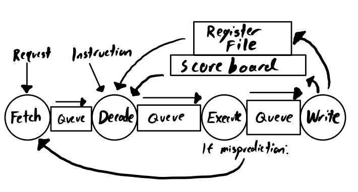
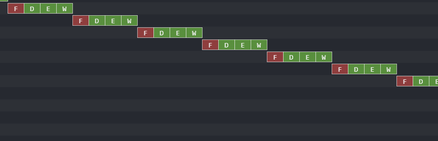
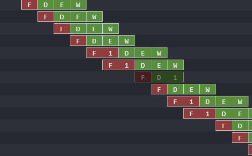

In the file `pipelined.bsv` fill out the `mkpipelined` module to implement a 4-staged pipelined mini-riscv processor (inspired by the lecture). To start, we provide a multicycle pipelined implementation in `multicycle.bsv` with several useful code chunks which you will almost entirely re-use in your implementation (it is expected you copy/paste most of the rules as a starting point).
At the beginning of `pipelined.bsv` we define structs for the data to store between stages. These should be useful for you but feel free to to change them if needed for your design.

As a refresher, a pipelined processor has queues between each stage. Mispredictions should be identified  if program counter predictions do not match up with the actual next program counter, and dealt with by neither sending a memory operation nor pushing the instruction to Writeback (and so never update the register file). 
Also, it is notable that a scoreboard must be implemented to deal with read-after-write and write-after-write data hazards . 
Typically you can simply use 32 register (or EHRs) holding a single boolean tracking if there is any outstanding write the corresponding register.
You may find the following diagram to be useful:

Here is an overall picture of the design you should build:



This lab is halfway between a lab and a miniproject. You have two weeks to complete it but there will be an intermediate checkoff after one week.
In the first checkoff, we will ask questions about the multicycle processor we gave (You should have read its code and understood it fully by then), and we will make sure you have made enough progress on your pipelined processor. After one week, you should have a full paper sketch of your design, all the state element needed, and some code for your design, that we can help you debugging.

# Running tests

We have a collection of a few tests:
  add32, and32, or32, hello32, thelie32, mul32, ... (see the full list in test/build/)

To run one of those tests specifically you can do:

```
./test.sh add32
./top_bsv # Will run add32 on the multicycle core
```
Or 
```
./test.sh add32
timeout 2 ./top_pipelined # Will run add32 on your future pipelined processor, it is often useful to add a timeout to avoid running forever
```

Those will generate a trace `output.log` that can be opened in Konata (see below).


You can also run all the tests with:
```
./test_all_multicycle.sh
./test_all_pipelined.sh
```

All tests but `matmul32` typically take less than 2s to finish. `matmul32` is much slower (30s to 1mn).

# A bunch of useful information

## Konata

When debugging/interacting with your processor, it may be useful to use a visualization tool called 'Konata'. Konata can be installed from [here](https://github.com/shioyadan/Konata) using your preferred method of installation. Konata can then be used on produced 'output.log' files (generated when you run your benchmarks) to generate a visualization of when 'Fetch', 'Decode', 'Execute' and 'Write' are called among other useful information. Specifically, Konata tells you the step you are on, the thread, retirement number, program counter, instruction bits, both potential registers, the type of instruction, and the ALU output.

You can already use Konata to visualize the execution of the baseline multicycle design, it should look like:



Once you will have implemented your pipelined processor successfully, the Konata visualization should look like:


To use Konata, you will have to generate event in each of the rule of your design. You can study `multicycle.bsv` as an example.  
In the skeleton code of `pipelined.bsv` we also gave some sketch of how to generate those events.

_Remark:_ With those event created, the testbench output large log, put in `output.log`. Those log can grow quickly, so you should not let a processor that does not complete a benchmark run for too long (no more than 60 seconds). This is the reason why we use the timeout command in the previous paragraph.

## Disassembled files

All the tests are written in C, you can find the source in "test/src/*.c".
For each test, we also provide the assembly code produced by the compiler in a `*.dump` file.
For example, for the test `add32` the assembly code is available in `test/build/add32.dump`.

While debugging a design, it is very common to have side-by-side: the processor-execute trace (either just as a sequence of display statement printed in the terminal, or the fancier version of using Konata), and the corresponding assembly code listing in a text editor. This is to understand the moment where things go in an unexpected way: maybe the problem is caused by a branch, maybe an instruction get stuck forever in the decode stage (identifying which one it is might help doing a good diagnostic), etc... The key to debugging is to first gather as much data as possible, and then walk through the debugging data gathered slowly. Start debugging your processor on simple tests before going to more complicated ones.

## Collection of registers

For the register file and the scoreboard, we advise you to use a vector of ehr (or registers for the first phase), like what you did in Lab3.

